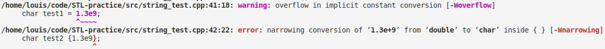

# C++11 新增特性总结

## 初始化列表

### 扩展了`{}`运算符

c++11 扩大了`{}`的适用范围，可以使用大括号来初始化内置类型和用户自定义类型，使用初始化列表的时候可以使用等号也可以不加。

初始化列表语法可以防止缩窄，会禁止将数值赋值给不能存储他的数值变量。

```c++
char test1 = 1.3e9;     // 内置类型编译时警告
char test2 {1.3e9};     // 使用初始化列表编译时报错
```



## 声明

### auto

从声明变量为局部自动变量变成类型推断关键字。

### 模板类 initializer_list ***(new add)***

```c++
class Test{
        int m_a;
        int m_b;
        int m_c;
    public:
        Test(int a = 0, int b = 1, int c = 4):m_a(a),m_b(b),m_c(c){};
};

Test item1(5,6);                            // #1
Test item2{2,89,4};                         // #2

auto test = {1,2,3,4,5};                    // #3
// type of test is initializer_list<int>
vector<int> vec1 = test;                    // #4
vector<int> vec2({2,3,4,5,6});              // #5
vector<int> vec3(test);                     // #6
vector<int> vec4{3,4,5,6,7};                // #7
vector<int> vec5 = {4,5,6,7,8};             // #8
```

考虑到 c++11 新增的列表初始化语法，通常，不仅可以使用`()`来调用构造函数，还可以使用`{}`来调用构造函数(上述第 #1 句和第 #2 句等价)。但是这会出现一个问题，那就是如果类构造函数中包含了使用`initializer_list<typename>`来作为构造函数参数的重载，这个时候就会产生冲突。所以当类构造函数有初始化列表的重载版本的时候，只有该版本（构造函数的参数是初始化列表类）的构造函数可以使用`{}`来调用构造一个对象。

## 有关于 valarray 类型

### valarray 对象的 begin 和 end ***(fix)***

在 c++ 中可以用于表示 “数组” 的类型有：vector,array,valarray。其中 vector 是可变长数组，可以通过 push_back() 等接口动态改变数组长度； array 是定长数组，没有 push_back() 方法；valarray 不是 STL 的内容，定长，没有 push_back()，没有 .begin() .end() 迭代器。所以在 C++11 中为了使得 valarray 适配数组接口，定义了函数 begin 和 end ，可以通过调用这两个函数来得到满足 .begin() .end() 语义区间的地址值。使用示例

```c++
vector<int> arr_vec(5) = {4,2,1,3,5};
sort(arr_vec.begin(),arr_vec.end());

array<int> arr_arr(5) = {4,2,1,3,5};
sort(arr_arr.begin(),arr_arr.end());

valarray<int> arr_valarr(5) = {4,2,1,3,5};
sort(begin(valarray),end(valarray));
```