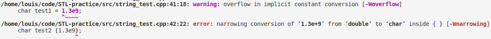

# C++11 新增特性总结

<!-- TOC -->
- [C++11 新增特性总结](#c11-新增特性总结)
  - [初始化列表](#初始化列表)
    - [扩展了`{}`运算符](#扩展了运算符)
  - [声明](#声明)
    - [auto](#auto)
    - [decltype](#decltype)
    - [返回类型后置](#返回类型后置)
    - [别名](#别名)
  - [空指针](#空指针)
  - [智能指针](#智能指针)
  - [有关于异常规范](#有关于异常规范)
  - [作用域内枚举](#作用域内枚举)
  - [跟类相关的修改](#跟类相关的修改)
    - [关键字 explicit](#关键字-explicit)
    - [类内初始化](#类内初始化)
  - [有关 STL 的修改](#有关-stl-的修改)
    - [for 循环](#for-循环)
    - [新增容器](#新增容器)
    - [新的 STL 方法](#新的-stl-方法)
    - [valarray 升级](#valarray-升级)
    - [关于尖括号](#关于尖括号)
    - [右值引用](#右值引用)
  - [新的类功能](#新的类功能)
    - [特殊成员函数](#特殊成员函数)
    - [默认函数和禁用函数](#默认函数和禁用函数)
    - [关于虚方法的覆盖和禁止覆盖](#关于虚方法的覆盖和禁止覆盖)
  - [lambda 函数](#lambda-函数)
  - [包装器](#包装器)
  - [模板类 initializer_list ***(new add)***](#模板类-initializer_list-new-add)
  - [有关于 valarray 类型](#有关于-valarray-类型)
    - [valarray 对象的 begin 和 end ***(fix)***](#valarray-对象的-begin-和-end-fix)

## 初始化列表

### 扩展了`{}`运算符

c++11 扩大了`{}`的适用范围，可以使用大括号来初始化内置类型和用户自定义类型，使用初始化列表的时候可以使用等号也可以不加。

初始化列表语法可以防止缩窄，会禁止将数值赋值给不能存储他的数值变量。

```c++
char test1 = 1.3e9;     // 内置类型编译时警告
char test2 {1.3e9};     // 使用初始化列表编译时报错
```



## 声明

### auto

从声明变量为局部自动变量变成类型推断关键字。

### decltype

用于获得表达式类型：

```c++
decltype(a + b) new_item;   //声明一个新的变量，该变量的类型与表达式 a+b 的返回值类型相同
```

### 返回类型后置

结合上面的 decltype 关键字，如果一个函数的返回值类型跟其输入有关系，那么这个时候就可以使用 decltype 关键字加上返回类型后置语法来实现。情景：函数 function 的入参类型为模板类型 T 和 U ，返回值类型为 item_T + item_U ：

```c++
template<typename T, typename U>
? function(T t,U u){...};
```

此时是没有办法来书写返回值的类型的，虽然 decltype 可以确定返回值类型 `decltype(t+u)` ，但是如果在函数最开始写上这一句来表示返回值类型，是有逻辑错误的，因为 t 和 u 尚未声明，是未定义的标识符，所以这个时候就需要使用  **返回类型后置** 语法：

```c++
template<typename T, typename U>
auto function(T t, U u) -> decltype(t+u)
{
   ... 
}
```

 **注意：** 该语法的 decltype 字段部分是接在函数声明以及参数列表之后。

### 别名

在 C 语言中，使用 `typedef` 来定义别名，但是在 C++11 中使用 `using=` 来定义别名：

```c++
// c
typedef int (*function_int_c)(int a, char b);
using function_int_cpp = int (*)(int a, char b);
```

上述两种方法都定义了一个函数指针别名，返回值类型为 int ，第一个参数类型为 int ，第二个参数类型为 char。

`using=` 语法并不只用于别名定义，还可以用于模板的具体化：

```c++
typename<typename T>
using arr8 = std::array<T,8>;

arr8<int> array_int_8;              // $1
arr8<std::string> array_string_8;   // $2
```

上述代码中，第 $1 行声明了一个一共有 8 个元素的定长数组，元素类型为 int；第 $2 行声明了一个一共有 8 个元素的定长数组，元素类型为 string。但是 typedef 是没有办法实现这样的定义的。

## 空指针

C++11 新增的关键字 nullptr。

## 智能指针

C++11 摒弃了 auto_ptr, 但是新增了三种智能指针，unique_ptr, shared_ptr, weak_ptr。

## 有关于异常规范

C++11 摒弃了异常规范，但是认为生命函数不会抛出异常还是有用的，所以新增了关键词 noexcept 来声明函数不会抛出异常。

## 作用域内枚举

作用域内枚举的作用是为枚举提供作用域，减少重名冲突，并且要求在引用的时候需要显示说明限定名（作用域名）。作用域内枚举是通过在枚举关键字 enum 和枚举内容之间显示加上 `class scope_name` 或者 `struct scope_name` 来实现的：

```c++
class Test{
    enum {my_lady, my_loard};                       // 原来在类中的枚举定义
    enum class first_scope{your_grace, your_print}; // 使用 class scope_name
    enum struct second_scope{your_grace, your_print}; // 使用 struct scope_name
    public:
        void function();
};

void Test::function()
{
    int a = my_lady;    // use it directly
    int b = first_scope::your_grace;    // use with scope_name::
}
```

正如上面的代码所示，使用作用域内枚举的枚举值的时候需要加上作用域解析运算符。

## 跟类相关的修改

### 关键字 explicit

C++ 很早便支持了对象的自动转换（只有一个参数的构造函数可以作为类型转换函数被隐式调用），但是隐式类型转换会出现问题，所以 C++11 添加了关键字 explicit 来限定构造函数，只有显式调用构造函数才能实现类型转换，否则编译阶段出错。

并且 C++11 扩展了 explicit 的用法，不仅可以限制构造函数必须显式调用，并且还限制了类型转换函数的显式调用。

```c++
class Test{
    public :
        explicit Test(int a);
        explicit operator double();
};
...
int main()
{
    Test a = 3;             // not allowed
    Test a = Test(3);       //OK

    double b = a;           // not allowed
    double b = double(a);   //OK
}
```

### 类内初始化

现在 C++11 允许在类内进行成员的初始化，但是初始化只能通过等号或者是初始化列表的方式：

```c++
class Test{
    int m_age = 24;
    std::string m_name {"louis"};
};
```

## 有关 STL 的修改

### for 循环

如果是要遍历一个容器，且该容器包含了 begin(),end() 方法，那么可以通过范围内循环的 C++11 新增语法来完成循环：

```c++
vector<int> int_arr;
// 如果不改变容器内内容
for(auto x : int_arr)
{
    ...
}
// 如果要改变容器内内容
for(auto & x : int_arr)
{
    ...
}
```

### 新增容器

C++11 新增了容器 

- forward_list
- unordered_map
- unordered_multimap
- unordered_set
- unordered_multiset

其中的 forward_list 是单向链表，只能单向遍历，与 list 的双向链接链表相比，更简单，另外四种底层都是使用的哈希表实现的，而原来的有序集合和 map 是通过树来实现的。

此外还新增了定长数组容器，array，具体化的时候需要指定其中的元素类型和数组长度。因为是定长，所以没有 push_back() 方法，但是为了能够使用 STL 算法，array 数组有 begin() 和 end() 方法。

```c++
array<int, 37> my_arr;
``` 

### 新的 STL 方法

添加了 cbegin(),cend() 方法作为 begin(),end() 方法的 const 版本，返回的元素都是 const 类型，同样的，新增了 crbegin(),crend() 作为 rbegin(),rend() 的 const 版本。

### valarray 升级

在 C++11 中 valarray 支持了 begin(),end() 方法。

### 关于尖括号

由于符号 `>>` 是有特定意义的，所以当在有嵌套模板或者是两个 `>` 符号会同时出现的时候，两个 `>` 之间应该至少一个空格隔开，以区分 `>>`

```c++
vector<list<string> > list_arr;
```

### 右值引用

左值参数是可以被引用的参数对象，如：

- 变量
- 数组元素
- 成员变量
- 引用
- 解除引用的指针

左值可以被取地址，也可以被赋值（const 限定的除外），可以通过地址来访问。C++11 新增了 **右值引用** ，使用 `&&` 表示。右值引用可以关联到右值。

右值：粗略来说就是不能对其运用取地址运算符的值。有出现在赋值运算符右边但是不能取地址的表达式（结果是一个临时值，如 x + y），有字面常量（如 "louis"），有返回值为值的函数（返回值类型如果是一个引用则不算是右值）。

```c++
int x = 4;
int y = 9;
int && z = 4;
int && right_expression = x + y;            // $1
int && right_const = 19;                    // $2
double && right_function = std::sqrt(3.0);  // $3
```

对于上面的第 $1 行，右值引用 right_expression 关联到的是 13，即便后面修改了 x 或者 y ，都不会影响到 right_expression 的值。有一个值得关注的点 **将右值引用关联到右值之后，会导致这个右值被保存到特定的位置，且可以获取该位置的地址。** 通过将右值引用与右值关联，使得在右值的调用之后还可以通过右值引用来访问该数据。

左值与右值引用都可以接收一个值（x 与 z），不过对于变量而言，是自动变量，在栈上分配的内存，但是对于右值引用，是保存在了特定的位置（哪里呢？）

> *我有一个疑问，既然修改了表达式的某一个变量不会影响到右值引用的值，且会分配地址来保存这个值，那么右值引用和左值变量有什么区别呢？为什么需要右值引用呢？* 对于修改表达式因子不会影响到结果这个好理解，毕竟这个表达式没有再次被计算。

> **针对上述问题的解答：为什么需要右值引用呢？避免不必要的内存申请、拷贝、释放。上述不必要的操作主要会出现在赋值、构造新的对象以及函数传参。**
> 
> **其中构造新的对象和函数传参的情景是一样的，这里函数传参考虑的是按值传递，因为如果函数参数是按引用传递（不论是左值引用还是右值引用），都是传递对象本身，没有多余操作，并且如果类型不对，会在编译时报错；只有按值传递的时候因为会产生临时对象，所以才可能出现多余的操作。按值传递的时候产生了一个临时对象，这个就跟构造一个新的对象是一样的。c++11 新增了默认的移动构造函数，如果没有手动书写移动构造函数，编译器会自动生成。移动构造函数并没有先产生一个临时对象，然后再赋值给目标对象，而是目标对象就是接收结果的“临时”对象。**
> 
> **然后再来说赋值运算的动作。如果有语句 `item3 = item1 + item2;`，在没有右值引用的时候，会先产生一个临时对象来接收 `item1 + item2` 的值，然后调用重载的赋值运算符成员函数来拷贝数据（如果程序员没有手动编写，编译器会自动生成一个默认的赋值运算符来执行浅拷贝，但是这种情况往往会出错，double free and so on，所以这里只考虑深拷贝），申请新的内存空间，然后把数据拷贝到新的内存中，再释放临时对象。所以其实原临时对象内存中的数据跟新内存中的数据是一模一样的。如果拷贝的数据量很大，那么这个时候就会花很多时间来把一模一样的数据从一个地方搬到另一个地方。而如果使用右值引用的话，可以直接转移那块内存的所有权，就不用搬动数据了。**
>
> **怎么使用右值引用？首先一点，需要在传递参数的时候传递右值；第二，有处理函数接收参数类型为右值引用的重载版本。函数调用的时候会识别出，传递而来的是左值还是右值，进而调用对应版本的函数。在右值引用版本的函数中，程序员可以执行想要的操作。实际代码可以参考 [right_reference.cpp](../../src/right_reference.cpp)，其中不同版本的类定义放在不同的命名空间中：namespace WithRigthReference, namespace JustLeftReference。**

## 新的类功能

### 特殊成员函数

在 [构造函数](./构造函数.md) 一文中，已经于`编译器会自动生成的函数`一节说明了编译器会自动生成的成员函数有

- 默认构造函数
- 复制构造函数
- 复制赋值运算符
- 析构函数

在 c++11 中新添加了两个特殊成员函数

- 移动构造函数
- 移动赋值运算符

```c++
someclass::someclass(const someclass &);                //default copy constructor
someclass::someclass(someclass &&);                     //default move constructor

someclass & someclass::operator=(const someclass &);    //default copy assignment
someclass & someclass::operator=(someclass &&);         //default move assignment
```

需要注意的是：

1. 如果定义了析构函数、复制构造函数、赋值运算符，那么编译器不会自动生成移动构造函数和移动赋值运算符；
2. 如果定义了移动构造函数、移动赋值运算符，那么编译器不会自动生成复制构造函数和赋值运算符；
3. 默认的移动构造函数和赋值运算符的行为也是逐成员拷贝，如果是内置类型，直接按值拷贝；如果是自定义类型的对象，会将该对象视为右值来调用对应类的构造函数；
4. 构造函数和赋值运算符，当传入的是一个右值的时候，调用的优先级为，右值参数版本，左值版本。如果没有定义高优先级版本则依次查找其余低优先级版本。**其中，调用 std::move() 实际上调用的是其类赋值运算符，调用优先级与上述相同。**

### 默认函数和禁用函数

`=default` 表示使用编译器默认会生成的函数，该语法只能用于上述所说的六个特殊成员函数；  
`=delete` 表示禁止使用这个函数，如果有匹配的特征标，则会视为编译错误。该语法可用于任何类成员函数。

```c++
class Test{
    public:
        Test(Test &&);                      // $1
        Test(const Test &) = default;       // $2
        Test & operator=(Test &&) = delete; // $3
        void function(double);              // $4
        void function(int) = delete;        // $5
};
```

由于第 $1 句定义了移动构造函数，所以编译器不会自动生成复制构造函数，但是第 $2 句使用 `=default` 语法，指定使用编译器的默认版本，此时该函数会被编译器生成。同时第 $3 句指定禁止使用移动复制运算符。

如果没有第 $5 句，那么 `function(4)` 的函数调用会变成 `function(4.0)` ，把 int 类型的数据提升为 double 类型来使用。但是如果加上了第 $5 句，则 `function(4)` 会编译时报错。

### 关于虚方法的覆盖和禁止覆盖

在派生类中对一个与基类成员虚函数同名的函数定义，会覆盖掉基类版本，所以如果需要对基类虚函数重新定义，那么需要保证派生类中该函数的特征标和基类中该函数的特征标相同。

标识符 `override` 用于派生类中，可以保证在编译阶段检测与基类同名虚函数的特征标相同，如果不同，编译时报错。

标识符 `final` 用于基类中，表示禁止派生类重新定义特定的虚函数。

```c++
class Base{
    public:
    virtual void function1(char c) final; 
    virtual void function2(char c); 
};
class Derived:public Base{
    public:
    virtual void function1(char *c);    //hidden : OK
    virtual void function1(char c);     //override : ERROR
    virtual void function2(char *c) override;   //not matching base version : ERROR
};
```

注意，`override` 和 `final` 都是标识符，并不是关键字，编译器会根据上下文语境来判断这两个标识符的含义，如果是在类声明中，那么就是对虚函数的管理标识符，在别的地方仍然可以被用作变量名等。

## lambda 函数

lambda 函数语法可以定义命名函数和匿名函数，相较于一般函数和函数类（函数符），源码阅读会比较方便。

三种函数使用方式对比：

- 函数方式  
    1. 类似于二元参数但是要使用一元方式来表示的情况，每一个不同的固定元素需要对应一个函数体，不灵活。**（不支持函数内定义）**
    2. 函数定义的位置可能与使用函数的位置距离较远，阅读源码时候需要多页翻阅。
- 函数符（函数类）  
    1. 可以使用类成员来表示固定元素，通过构造函数来修改固定元素，同理相当于通过类构造函数传入参数不同来定义不同固定元素的函数，灵活性好。**（在函数内可创建对象，相当于函数内定义）**
    2. 函数定义的位置就是对象声明的位置，但是翻阅类定义才能知道类方法的细节。
- lambda 表达式  
    1. 匿名函数的定义与使用是在同一个地方，定义即使用；命名函数的定义可以直接在使用之前，因为 lambda 表达式支持**函数内定义**。

```c++
//匿名 lambda 函数定义
vector<int> numbers(100);
std::for_each(numbers.begin(),numbers.end(),[](int x){std::cout << x;});
//命名 lambda 函数
auto my_function = [&](int x) ->double {cout << "test " << x << endl;return 3;};
double result = my_function(99);    //调用命名 lambda 函数
```

**lambda 表达式说明：**

`[]` 中表示要捕获的变量。lambda 表达式可以捕获其所在作用域中的任何变量，如果直接在 `[name]` 放入变量，这个时候就是按值传递变量名为 name 的变量； `[=]` 表示可以按值访问作用域中的任何动态变量； `[&name]` 表示是按引用访问变量 name ，而 `[&]` 表示可以按引用访问作用于中的所有变量。上述方法可以混合使用 `[=,&name]` 或者 `[&,name]`，只要不引起冲突就行。*`[&,=]` 或 `[=,&]` 或 `[=,name]` 或 `[&,&name]` 都会引起冲突。* 

lambda 表达式的返回值类型在仅有一个 `return` 的时候是自动推断的，相当于调用了 decltype ,如果需要指定返回值类型，可以使用后置返回值类型语法。

## 包装器

有了 lambda 表达式，有了函数符，还有具体化定义的函数，这些都是可被调用的，但是他们的类型却不相同，如果一个模板函数的其中一个入参是可被调用的，那么上述不同类型的入参虽然产生的实际效果是一样的，但是却有多个实例化。如果这个模板函数里面还有静态变量，那么这个静态变量的值还不一定是正确的（一个模板实例化有一个自己的静态变量）。所以这个时候可以使用包装器来将可调用的变量进行一次包装。

在头文件 *functional* 中有一个包装模板类 `std::function`，他包装有相同函数特征标的函数为一个类型。

```c++
#include <functional>
class FunctionClass{
    public:
        double operator()(double);
};

double my_function1(double){};
auto my_function2 = [](double)->double{};
FunctionClass my_function3;

int test_invoke_function_para(std::function<double(double)> input_function)
{
    static int invoked_count = 0;
    invoked_count++;
    input_function(3.0);
    return 1;
}

int main()
{
    test_invoke_function_para(my_function1);    //invoked_count = 1
    test_invoke_function_para(my_function2);    //invoked_count = 2
    test_invoke_function_para(my_function3);    //invoked_count = 3
    return ;
}
```

上述代码片段中的 my_functionX 都是返回值类型是 double，一个入参类型是 double，所以对于函数test_invoke_function_para（这里没有定义成函数模板，不过通过三次调用说明了形参类型确实匹配了三个函数），通过包装器指定了输入函数的特征标为 double(double)，以此来适配三个函数。

## 模板类 initializer_list ***(new add)***

```c++
class Test{
        int m_a;
        int m_b;
        int m_c;
    public:
        Test(int a = 0, int b = 1, int c = 4):m_a(a),m_b(b),m_c(c){};
};

Test item1(5,6);                            // #1
Test item2{2,89,4};                         // #2

auto test = {1,2,3,4,5};                    // #3
// type of test is initializer_list<int>
vector<int> vec1 = test;                    // #4
vector<int> vec2({2,3,4,5,6});              // #5
vector<int> vec3(test);                     // #6
vector<int> vec4{3,4,5,6,7};                // #7
vector<int> vec5 = {4,5,6,7,8};             // #8
```

考虑到 c++11 新增的列表初始化语法，通常，不仅可以使用`()`来调用构造函数，还可以使用`{}`来调用构造函数(上述第 #1 句和第 #2 句等价)。但是这会出现一个问题，那就是如果类构造函数中包含了使用`initializer_list<typename>`来作为构造函数参数的重载，这个时候就会产生冲突。所以当类构造函数有初始化列表的重载版本的时候，只有该版本（构造函数的参数是初始化列表类）的构造函数可以使用`{}`来调用构造一个对象。

## 有关于 valarray 类型

### valarray 对象的 begin 和 end ***(fix)***

在 c++ 中可以用于表示 “数组” 的类型有：vector,array,valarray。其中 vector 是可变长数组，可以通过 push_back() 等接口动态改变数组长度； array 是定长数组，没有 push_back() 方法；valarray 不是 STL 的内容，定长，没有 push_back()，没有 .begin() .end() 迭代器。所以在 C++11 中为了使得 valarray 适配数组接口，定义了函数 begin 和 end ，可以通过调用这两个函数来得到满足 .begin() .end() 语义区间的地址值。使用示例

```c++
vector<int> arr_vec(5) = {4,2,1,3,5};
sort(arr_vec.begin(),arr_vec.end());

array<int> arr_arr(5) = {4,2,1,3,5};
sort(arr_arr.begin(),arr_arr.end());

valarray<int> arr_valarr(5) = {4,2,1,3,5};
sort(begin(valarray),end(valarray));
```

[返回主目录](../../README.md)