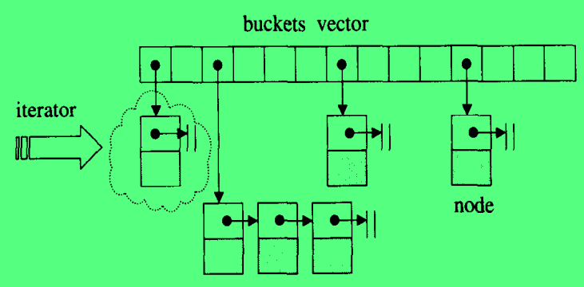

# 关联式容器

标准的 STL 关联式容器分为 set（集合） 和 map（映射表） 两大类，以及两大类的衍生类，多键集合 multiset 和 多键映射表 multimap。这些容器的底层都是使用红黑树来完成的。

SGI STL 还提供了一个不在 STL 标准之内的关联式容器，散列表 hash table，以及以此 hash table 为底层机制的 hash_set（散列集合）、hash_map（散列映射表）、hash_multiset（散列多键集合）、hash_multimap（散列多键映射表）。

所谓关联式容器，就是类似于关联式数据库这样的关系，每一笔数据都是一个键值对，当把数据存到关联式容器中的时候，会根据这笔数据中的键值来确定将这笔数据放置到关联式容器中的哪个位置上。其中 set 的键值和实值是相同的，或者说其键值就是实值；不过 map 中，键值可以和实值分开，这样其实键值和实值之间就形成了一种映射关系，这也就是 map 被称为映射表的原因。

关联式容器没有所谓的首尾之分，所以在关联式容器中没有 `push_back()`,`push_front()`,`pop_back()`,`pop_front()`,`end()`,`begin()`等操作。一般而言，**关联式容器的内部结构都是一种平衡二叉树。** 以此来获得良好的搜索效率。

### 关于树的一些定义

1. 根节点至任意节点都有一条唯一的**路径**；
2. 路径所经过的边树称为该路径的**长度**；
3. 根节点至任意节点的路径长度称为该节点的**深度**，**根节点深度永远是0** ；
4. 某节点至其最深子叶节点的路径长度为该节点**高度**，**整棵树的高度由根节点的高度来表示** ；

### 平衡二叉树平衡性维持

平衡二叉树定义：一颗二叉搜索树，任意节点的左右子树高度相差最多是 1 。

当在一棵平衡二叉树中插入一个新节点之后，可能会破坏二叉树的平衡性，这个时候就需要调整树的结构，以重新保持平衡。

**插入一个新节点，如果平衡性被破坏，那么，平衡性被破坏的子树的根节点一定在新插入节点到根节点的这条路径上。** 因为只有这些节点的子树高度增加了 1 。**而只需要调整这条路径上，平衡性被破坏的子树中子树根节点深度最深的子树即可** 。


左边的树是平衡的，当插入节点 11 之后树的平衡性被破坏，其中节点 18 和 22 的子树平衡性被破坏了，而 18 是深度最深的节点，所以后续保持整棵树的平衡性就需要调整 18 节点子树的相关结构。

将子树分离出来，插入点可以分为以下四类：

1. 插入点是子树根节点**左儿子**的**左子树**，归纳为 **"左左"** 插入；
2. 插入点是子树根节点**左儿子**的**右子树**，归纳为 **"左右"** 插入；
3. 插入点是子树根节点**右儿子**的**左子树**，归纳为 **"右左"** 插入；
4. 插入点是子树根节点**右儿子**的**右子树**，归纳为 **"右右"** 插入；


其中 1、4 是对称的，被称为**外侧插入**； 2、3 是对称的，被称为**内侧插入**。

对于外侧插入的情况，只需要进行一次**单旋**就可以重新保持平衡；对于内侧插入的情况就需要进行一次**双旋**才能重新保持平衡。

> 单旋分两种，左旋或者右旋；  
> 双旋是两次单旋操作的集合，有两种情况，先左旋再右旋，或者是先右旋再左旋。  
> 关于单旋和双旋的细节，可以参考《算法导论》。

### RB-tree

红黑树的定义：一棵二叉搜索树，且满足以下定义：

1. 每一个节点都有颜色，非黑即红。
2. 二叉树根节点是黑色；
3. 红色节点的儿子一定是黑色；
4. 根节点到每个叶子节点的路径上，黑色节点数目相同；

根据上述的定义，可以有以下推论：

1. **一个叶子节点的兄弟节点如果也是叶子节点，那么一定同色；**
2. **如果不同色，那该叶子节点一定为黑色，其兄弟节点一定还有子树，且子树中每条路径上最多只有一个黑色节点；**
3. **如果该叶子节点没有兄弟节点，那么这个叶子节点为红色。** 

定义，新插入节点为 X ，其父节点为 P ，其伯父节点为 S，祖父节点为 G ，曾祖父节点为 GG 。

插入过程中判断 X 是属于内侧还是外侧插入，是根据 X、P、G 三者之间的关系：

1. X = G->LP->L; || X = G->RP->R; 外侧插入。
2. X = G->LP->R; || X = G->RP->L; 内侧插入。

在一个新的结点插入到红黑树中之前，该红黑树是满足红黑定义的，所以为了不破坏掉第 4 条规则，新插入的节点应该是红色的。如果此时的 P 节点，也就是插入节点 X 的父节点是黑色的，那么插入过程就结束了。但是如果 P 节点是红色的，根据第三点，一定没有一对父子节点都是红色的，所以这个时候就需要调整这棵树的相关结构以及颜色，使其重新保持红黑树的要求。

插入节点 X 是红色，其父节点 P 也是红色，同样根据第 3 条可以推断出此时的 G 节点一定是黑色的，在确定了这三个节点的颜色之后，就可以将插入分为以下四种不同的情况了：

1. S 为**黑色**（*需要引入黑色哨兵机制，否则不会出现 P 为红色而 S 为黑色的情况*），并且 X 是**外侧**插入：旋转 P 和 G ，然后改变 P、G 的颜色，即 P(r->b),G(b->r);
2. S 为**黑色**，并且 X 是**内侧**插入：先对 P 和 X 做一次单旋，并改变 G、X 颜色，然后再对上述的结果，对 G 做一次单旋；
3. S 为**红色**，并且 X 是**内侧**插入：只需要对 P、G 做一次单旋即可，并不需要改变任何颜色；
4. S 为**红色**，并且 X 是**外侧**插入：先对 P、G 做一次单旋，然后改变 X 的颜色，此时最高为 P 点，且为红色，接下来需要判断 GG 颜色：
   1. GG 为黑色：结束，不需要做修改；
   2. GG 为红色：此时将原来的 P 视为新的 X(r)，将原来的 GG 视为新的 P(r)，原来的 GGG 视为新的 G(b)，递归执行前述过程，直到没有父子节点都为红色为止。

> 只有 "黑色伯父，内侧插入" 是旋转 P、X，其余都是旋转 P、G

### 红黑树的节点结构

首先来说，红黑树是一棵树，所以红黑树的结构就是一个个节点以及指向相互指向的指针形成的边所组成，所以实际保存在内存中的就是一个个节点。因为红黑树的基础结构是固定不变的，唯有保存于其内的数据可能会变化，所以这里对红黑树节点是一个两层的设计，基础层是节点的公有结构，然后在提供一个模板层，继承基础层，以这种技巧来提高节点的高适用性。

```c++
typedef bool __rb_tree_color_type;
const __rb_tree_color_type __rb_tree_red = false;
const __rb_tree_color_type __rb_tree_black = true;
struct __rb_tree_node_base{
    typedef __rb_tree_color_type color_type;
    typedef __rb_tree_node_base* base_ptr;

    color_type color;
    base_ptr parent;
    base_ptr left;
    base_ptr right;

    static base_ptr minimum(base_ptr x){...}
    static base_ptr maximum(base_ptr x){...}
};

template<typename Value>
struct __rb_tree_node:public __rb_tree_node_base{
    typedef __rb_tree_node<Value>* link_type;
    Value value_field;
};
```

rb_tree 的迭代器也是设计成了两层，基础层 __rb_tree_base_iterator 中有一个数据成员 node， 为 __rb_tree_node_base 类型，然后还有前进和后退方法（即整个树中比自己打的最小数和比自己小的最大数）；派生层 __rb_tree_iterator 重载了运算符。

### 红黑树定义

```c++
template<typename Key,typename Value,typename KeyOfValue,typename Compare,typename Alloc=alloc>
class rb_tree{
    protected:
        typedef void* void_pointer;
        typedef __rb_tree_node_base* base_ptr;
        typedef __rb_tree_node<Value> rb_tree_node;
        typedef __rb_tree_color_type color_type;
    public:
        typedef Key key_type;
        typedef Value value_type;
        typedef value_type* pointer;
        typedef value_type& reference;
        typedef rb_tree_node* link_type;
    protected:
        size_type node_count;
        link_type header;
        Compare key_compare;

        link_type& root() const {return (link_type&)(header->parent;)}
        link_type& leftmost() const {return (link_type&)(header->left;)}
        link_type& rightmost() const {return (link_type&)(header->right;)}

        static link_type& left(link_type x){return (link_type&)(x->left);}
        static link_type& right(link_type x){return (link_type&)(x->right);}
        static link_type& parent(link_type x){return (link_type&)(x->parent);}
        static reference value(link_type x){return x->value_field;}
        static const key_type& key(link_type x){return KeyOfValue()(value(x));}
        static color_type& color(link_type x){return (color_type&)(x->color);}
    public:
        typedef __rb_tree_iterator<value_type,reference,pointer> iterator;
    public:
        Compare key_comp() const {return key_compare;}
        iterator begin(){return leftmost();}
        iterator end(){return header;}
        bool empty() const {return node_count == 0;}
        size_type size() const {return node_count;}
    public:
        pair<iterator,bool> insert_unique(const value_type& x);
        iterator insert_equal(const value_type& x);
    ...
};
```

实际还隐藏了很多实现细节，有一个地方值得注意就是 `key()` 函数的实现，内部是调用的 `KeyOfValue(value(x));`，首先， KeyOfValue 是模板参数里面的，是一种类型，这里在其后直接跟了一个括号，代表的是函数调用，所以这里的 KeyOfValue 是一个函数符类型，或者叫做函数指针类型，第二个括号中的是这个函数的参数列表。

红黑树提供了两种插入接口，insert_unique() 和 insert_equal()，可以根据字面意思知道，前者表示被插入节点的键值在整棵树中是唯一的，如果插入的时候当前树中已经有了该键值对应的节点，那么插入动作是不会被执行的；而后者表示被插入节点的键值在整棵树中是可以重复的，因此无论如何插入都会成功，除非内存分配失败。*这两个接口的入参都是实值，而没有键值，这是因为前面提到的 KeyOfValue 这个模板类型值，他是个仿函数，可以通过这个仿函数使用实值来提取出键值。*

## set

在 set 容器中的所有元素都会根据键值自动被排序，键值唯一，并且 set 中元素的实值就是其键值，也正是因为如此，通过 set 的迭代器是不允许修改实值的，因为实值就是键值，键值一旦被修改了，会导致 set 底层结构的混乱，所以 set 的迭代器底层实现为 const_iterator ，是不允许别修改的。

从红黑树的代码中可以看到，插入是有两种接口的，一种是 insert_unique, 一种是 insert_equal，其中，set 只能调用 insert_unique，而 multiset 调用的是 insert_equal 来向集合中插入元素。

STL 为 set/multiset 提供了一套集合算法，包括

- 交集 set_intersection
- 并集 set_union
- 差集 set_difference
- 对称差 set_symmetric_difference

等，详细内容参看 [算法](./算法.md) 一节。

### set 源码摘录

```c++
template<typename Key,typename Compare=less<Key>,typename Alloc=alloc>
class set{
    public:
        typedef Key key_type;
        typedef Key value_type;     //键值等于实值
        typedef Compare key_compare;
        typedef Compare value_compare;

    private:
        typedef rb_tree<key_type,value_type,identity<value_type>,key_compare,Alloc> rep_type;
        rep_type t;     // set 的底层使用红黑树
    public:
        typedef typename rep_type::const_iterator iterator;
        ...
    public:
        //构造函数接口
        set():t(Compare()){};
        explicit set(Compare& comp):t(comp){};
        //前者使用的是 Compare(),而后者使用的会 comp，是因为 Compare只是一个仿函数类型，加上小括号之后就是一个实参了。
        template<typename InputIterator>
        set(InputIterator first,InputIterator last):t(Compare()){t.insert_unique(first,last);}
        
        template<typename InputIterator>
        set(InputIterator first,InputIterator last,const Compare& comp):t(comp){t.insert_unique(first,last);}

        set(const set<Key,Compare,Alloc>& x):t(x.t){}

    public:
        //set 提供的接口
        key_compare key_comp() const {return t.key_comp();}
        value_compare value_comp() const {return t.value_comp();}
        iterator begin() const {return t.begin();}
        iterator end() const {return t.end();}
        reverse_iterator rbegin() const {return t.rbegin();}
        reverse_iterator rend() const {return t.rend();}
        bool empty() const {return t.empty();}
        size_type size() const {return t.size();}
        void swap(set<Key,Compare,Alloc>& x){t.swap(x.t);}

        // 三个 insert
        pair<iterator,bool> insert(const value_type& x){
            pair<typename rep_type::iterator,bool> p = t.insert_unique(x);
            return pair<iterator,bool>(p.first,p.second);
        }

        iterator insert(iterator& position, const value_type& x){
            typedef typename rep_type::iterator rep_iterator;
            return (itreator)(t.insert_unique((rep_iterator&)position,x);)
        }

        template<InputIterator>
        void insert(InputIterator first, InputIterator last){
            t.insert_unique(first,last);
        }

        //三个 erase
        void erase(iterator position){
            typedef typename rep_type::iterator rep_iterator;
            t.erase((rep_iterator&)position);
        }
        size_type erase(const key_type& x){
            return t.erase(x);
        }
        void erase(iterator first, iterator last){
            typedef typename rep_type::iterator rep_iterator;
            t.erase((rep_iterator&)first, (rep_iterator&)last);
        }

        //-----
        void clear(){t.clear();}
        //重新定义 STL 中的一些算法
        iterator find(const key_type& x) const {return t.find(x);}
        size_type count(const key_type& x) const {return t.count(x);}
        iterator lower_bound(const key_value& x) const {return t.lower_bound(x);}
        iterator upper_bound(const key_value& x) const {return t.upper_bound(x);}
        pair<iterator,iterator> equal_range(const key_value& x) const {return t.equal_range(x);}
};
```

简要说明一下，`lower_bound()`,`upper_bound()`,`equal_range()`都是应用于有序区间，其中`lower_bound(x)`是返回当前有序区间中比 x 大的最小数（迭代器），同理`upper_bound(x)`是返回当前有序区间中比 x 小的最大数（迭代器），`equal_range(x)`是返回当前有序区间中与 x 相等的区间，是一对迭代器。

算法相关的详细内容参看 [算法](./算法.md) 一节。

## map

map 所有元素都是 pair 类型，其中 .first 代表的是键值， .second 代表的是实值。 map 中的元素会根据键值自动排序，且 map 不允许不同的节点出现相同的键值。

对于键值，map 和 set 都是一样，不允许修改键值，因为会根据键值排序，安排节点的存放结构，如果修改了键值，会破坏 map 的结构。但是 map 与 set 的一个不同之处在于，map 可以修改实值。

map 的底层也是使用的红黑树来实现的。大部分代码与 set 一样，都是调用的 rb_tree 所实现的公共接口，一些特殊的地方摘要如下：

```c++
template<typename Key,typename T,typename Compare = less<Key>,typename Alloc = alloc>
class map{
    typedef Key key_type;
    typedef T data_type;
    typedef pair<key_type,data_type> value_type;
    ...
    T& operator[](const key_type& k){
        return (*((insert(value_type(k,T()))).first)).second;
    }
    ...
}
```

首先一点是 map 的 value_type，如前所述他是一个 pair，是一个键值对。

其次是随机访问运算符的实现，主要分为了以下几步：

1. 构造了一个临时变量，键值为 k，实值部分使用实值类型的默认构造函数来构造；
2. 调用 insert 函数，insert 函数是调用的底层 rb_tree 的 `insert_unique` 函数，返回的是一个 `pair<iterator,bool>` 类型的变量，因为这个传入的键值就是 map 中已经存在的键值，所以得到的就是这个键值对应的红黑树节点迭代器与一个 false；
3. 对红黑树的迭代器进行解引用，得到的是存放在红黑树中的实际数据，其数据类型是 map 的 value_type，也就是 `pair<key_type,data_type>`，所以这时候取其 data_type 的值就是取实值。

map 与 set 一样，也重新实现了一些 STL 算法，`find()`、`lower_bound()`、`upper_bound()`、`euqal_range()`。

multiset 与 set 的接口、特性和用法都相同，唯一不同的是允许元素存在相同的键值，所以他的 insert 操作调用的是 rb_tree 的 `insert_equal()`。multimap 与 map 的关系和 multiset 与 set 的关系一样，不同的也是调用的是 `insert_equal()` 而非 `insert_unique()`。

## hashtable

前面所提到的平衡二叉搜索树，具有对数平均时间的表现，但是其插入的对数平均时间表现依赖于插入的随机性。而散列表，他的插入，删除，查找都是具有常数时间表现，并且这种常数时间表现是以统计为基础，不依赖输入元素的随机性。

散列表可以看作是一个字典数据结构，因为要想实现常数时间的操作，就需要可以根据索引直接得到值。一个解决方案就是使用一个可以随机访问的容器来保存数据，此时索引就是下标，值就是 container\[index]，i/d/f 都是常数时间完成。

但是上述方法有一个问题，如果需要保存的元素非常多，那么所需要的容器大小就会很大。为了解决上述问题，可以通过散列函数，使得索引被限制在容器大小范围内，通过这种方式，可以减少对容器大小的需求，但是出现的新问题是会产生**碰撞**。所谓碰撞就是当元素个数大于容器大小的时候，一定会有至少两个不同元素被散列到同一个容器空格。

解决碰撞的算法有很多，线性探测、二次探测、拉链法（开链法）等等。

一些名词：

1. 负载系数：元素个数除以容器大小，除了拉链法，其余的负载系数都应该在 0-1 之间。（？？？）

**线性探测**：经过哈希函数计算得到的索引位置为 H，如果此时位置 H 上面已经存在了元素，那么就接着搜索 H + 1 位置上是否已经存在了元素，如果也存在，则搜索 H + 2 位置，以此类推。这就是线性探测，探测的函数表达式为 H + i 。线性探测可以保证，如果当前的容器中有空余位置，则一定能找到该空余并填入元素；但是线性探测有一个问题就是碰撞的成长幅度很大，假如当前容器从起始位置连续被填充了很多元素，仅末尾有空余位置，此时一个新的元素经过计算，插入位置为 H，是当前容器的起始位置，那么这个元素的插入过程就相当于需要遍历一遍容器。

**二次探测**：二次探测就是为了解决线性探测过程中，可能需要大量遍历的问题。二次探测的函数表达式为 H + i<sup>2</sup>。

但是解决了一次探测问题的同时也引入了新的问题，那就是：

1. 线性探测每次探测都是一个不同的位置，二次探测呢？
2. 二次探测涉及到乘法运算，运行效率如何？
3. 不论线性探测还是二次探测，当负载系数过高的时候，哈希表是否能够动态增长？

对于上述第一和第三个问题，解答为：如果散列表的大小为一个质数，并且复杂系数不大于 0.5（如果大于就需要重新调整散列表的大小为下一个不小于当前大小两倍的质数），那么二次探测是可以在不多于两次的探测中找到空余位置插入的。

对于第二个问题，设 *H<sub>i</sub> = (H<sub>0</sub> + i<sup>2</sup>)(mod M)*，*H<sub>i-1</sub> = (H<sub>0</sub> + (i-1)<sup>2</sup>)(mod M)*，则 *H<sub>i</sub>-H<sub>i-1</sub> = (2i-1)(mod M)*。其中的 2 倍乘法可以通过移位运算求得，所以如果通过上一个探测计算结果来求下一个探测位置，性能损耗与线性探测相比相差不多。

另外就是关于散列表的扩充，大小需要为质数已经提过，还有就是关于已有元素的重新定位。在新的散列表中，原来的元素并不能直接拷贝，而是需要根据新的散列表大小重新计算放置位置。

二次探测会遇到跟一次探测有些类似的问题，如果两个元素通过散列函数得到的初始插入位置相同，那么后续的探测，位置也都是相同的。所以可以使用复式散列来解决问题，H<sub>0</sub> = HashFunc1(key) + HashFunc2(key)。

**开链法** ：SGI STL 所采用的方法。

### SGI hashtable 结构总览



上图中的第一维，是使用 vector 实现，其一是为了能够自动扩展，其二是 vector 可以随机访问，当使用 hash function 算出位置之后可以在常数时间内访问到对应的 vector 项。第二维是一个链表，当有碰撞发生的时候，就将他们用链表的方式组织起来，为了常数时间插入，所以后来的是插入到链表头。这里的链表并没有使用 STL 的 list 或者 slist，而是使用的单纯的链表。

```c++
template<typename Value>
struct __hashtable_node{
    __hashtable_node * next;
    Value val;
};
```

### hashtable 的迭代器

```c++
template<typename Value,typename Key, typename HashFcn,typename ExtractKey,typename EqualKey,typename Alloc>
struct __hashtable_iterator{
    typedef __hashtable_iterator<Value,Key,HashFcn,ExtractKey,Equal,Alloc> iterator;
    typedef hashtable<Value,Key,HashFcn,ExtractKey,Equal,Alloc> hashtable;
    typedef __hashtable_node<Value> node;

    typedef forward_iterator_tag iterator_category;
    ...

    node *cur;
    hashtable* ht;

    ...
};
```

首先一点，hashtable 的迭代器是单向迭代器，不支持随机访问，也不支持 `--` 操作，没有逆向迭代器。然后，每个迭代器指向一个 __hashtable_node 节点，也就是 hashtable 中的第二维的单纯的链表节点。最后，一个迭代器应该与一个散列表相关联。

### hashtable 的构造与内存管理

```c++
template<typename Value,typename Key, typename HashFcn,typename ExtractKey,typename EqualKey,typename Alloc>
class hashtable{
    ...
    private:
        typedef __hashtable_node<Value> node;
        vector<node *,Alloc> buckets;
        size_type num_elements; //元素个数，一个节点就是一个元素
    public:
        size_type bucket_count() const {return buctkes.size();}
    ...
};
```

在上述对于二次探测三个问题的回答中，提到了有关散列表大小的话题，从那里可以看出，当散列表的大小是一个质数的时候是可以降低碰撞几率的，所以将这个特性也带到了开链法中来。虽然开链法没有要求散列表的大小是质数，但是实际的实现是将其设置为质数大小，即一个散列表对象调用成员函数 `bucket_count()` 之后的返回值是一个质数。

往散列表中插入一个新的数据成员，在最开始会去判断是否需要调整散列表大小，而判断的依据有些特别，即使采用的是开链法，但是判断的时候却是用当前所存储的元素个数和 buckets.size() 作比较。如果要保存元素个数大于 buckets.size() ，即使有的 vector 位置为空，有的链上有多个元素，都会重新调整 vector 的大小为比要保存元素个数大的质数的大小。举个例子，当前散列表 buckets.size() = 7; num_elements = 7; 此时插入一个新元素，因为 7+1>7，所以会调整 buckets 大小为 11，比 8 大的下一个质数。**如果要调整大小，那么还是会和之前所述一样，需要重新调整各个 bucket 在新的散列表中的位置。**

重新调整位置的时候需要使用哈希函数来确定在新的散列表中的位置（下标），在 SGI 的实现中，将 HashFunction 封装了一层，在类 hashtable 实现中调用的是 bkt_num，但是该函数实际调用的是模板参数 HashFcn 所指代的函数。

SGI 内建了一些哈希函数：

```c++
template<typename Key> struct hash{};

inline size_t __stl_hash_string(const char *s){
    unsigned long h=0;
    for(;*s;s++)
        h = 5*h + *s;
    return size_t(h);
}

template<> struct hash<char*>{
    size_t operator()(const char * s){return __stl_hash_string(s);}
};
template<> struct hash<const char*>{
    size_t operator()(const char * s){return __stl_hash_string(s);}
};
template<> struct hash<char>{
    size_t operator()(char s){return s;}
};

template<> struct hash<short>{
    size_t operator()(short s){return s;}
};

template<> struct hash<int>{
    size_t operator()(int s){return s;}
};

template<> struct hash<long>{
    size_t operator()(long s){return s;}
};
```

内建的这些哈希函数，对于 c 字符串类型，做了一次转换，对于 char,short,int,long 类型，都是直接返回其值。如果用户需要对 string,float,double 等类型或者自定义类型做哈希运算，那么就需要自己提供哈希函数。

**hash_set,hash_multiset,hash_map,hash_multimap，这些都是与前述的对应关联式容器拥有相同的特性，唯一不同的就是前述的关联式容器底层都是使用红黑树来实现，而这些的底层都是使用的散列表来实现。** 

[返回主目录](../../README.md)