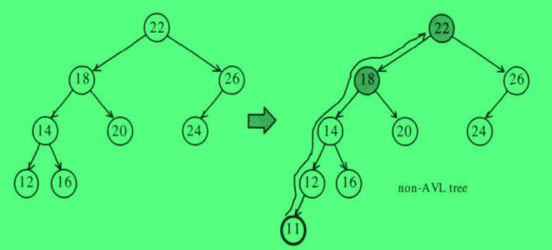
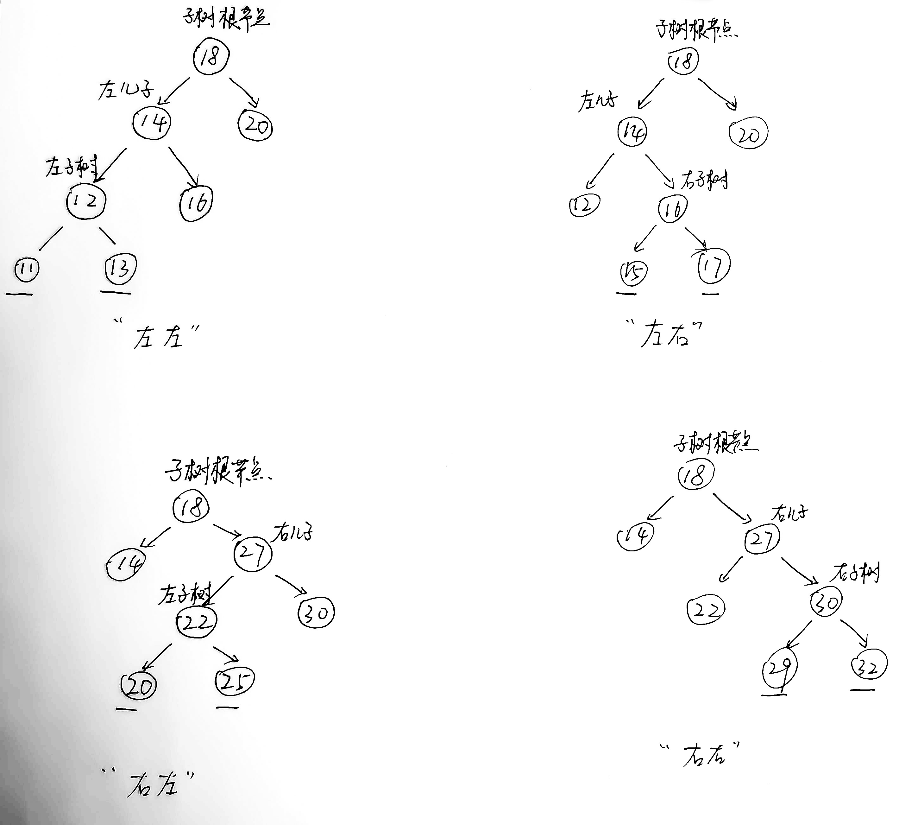

# 关联式容器

标准的 STL 关联式容器分为 set（集合） 和 map（映射表） 两大类，以及两大类的衍生类，多键集合 multiset 和 多键映射表 multimap。这些容器的底层都是使用红黑树来完成的。

SGI STL 还提供了一个不在 STL 标准之内的关联式容器，散列表 hash table，以及以此 hash table 为底层机制的 hash_set（散列集合）、hash_map（散列映射表）、hash_multiset（散列多键集合）、hash_multimap（散列多键映射表）。

所谓关联式容器，就是类似于关联式数据库这样的关系，每一笔数据都是一个键值对，当把数据存到关联式容器中的时候，会根据这笔数据中的键值来确定将这笔数据放置到关联式容器中的哪个位置上。其中 set 的键值和实值是相同的，或者说其键值就是实值；不过 map 中，键值可以和实值分开，这样其实键值和实值之间就形成了一种映射关系，这也就是 map 被称为映射表的原因。

关联式容器没有所谓的首尾之分，所以在关联式容器中没有 `push_back()`,`push_front()`,`pop_back()`,`pop_front()`,`end()`,`begin()`等操作。一般而言，**关联式容器的内部结构都是一种平衡二叉树。** 以此来获得良好的搜索效率。

### 关于树的一些定义

1. 根节点至任意节点都有一条唯一的**路径**；
2. 路径所经过的边树称为该路径的**长度**；
3. 根节点至任意节点的路径长度称为该节点的**深度**，**根节点深度永远是0** ；
4. 某节点至其最深子叶节点的路径长度为该节点**高度**，**整棵树的高度由根节点的高度来表示** ；

### 平衡二叉树平衡性维持

平衡二叉树定义：一颗二叉搜索树，任意节点的左右子树高度相差最多是 1 。

当在一棵平衡二叉树中插入一个新节点之后，可能会破坏二叉树的平衡性，这个时候就需要调整树的结构，以重新保持平衡。

**插入一个新节点，如果平衡性被破坏，那么，平衡性被破坏的子树的根节点一定在新插入节点到根节点的这条路径上。** 因为只有这些节点的子树高度增加了 1 。**而只需要调整这条路径上，平衡性被破坏的子树中子树根节点深度最深的子树即可** 。



左边的树是平衡的，当插入节点 11 之后树的平衡性被破坏，其中节点 18 和 22 的子树平衡性被破坏了，而 18 是深度最深的节点，所以后续保持整棵树的平衡性就需要调整 18 节点子树的相关结构。

将子树分离出来，插入点可以分为以下四类：

1. 插入点是子树根节点**左儿子**的**左子树**，归纳为 **"左左"** 插入；
2. 插入点是子树根节点**左儿子**的**右子树**，归纳为 **"左右"** 插入；
3. 插入点是子树根节点**右儿子**的**左子树**，归纳为 **"右左"** 插入；
4. 插入点是子树根节点**右儿子**的**右子树**，归纳为 **"右右"** 插入；



其中 1、4 是对称的，被称为**外侧插入**； 2、3 是对称的，被称为**内侧插入**。

对于外侧插入的情况，只需要进行一次**单旋**就可以重新保持平衡；对于内侧插入的情况就需要进行一次**双旋**才能重新保持平衡。

> 单旋分两种，左旋或者右旋；  
> 双旋是两次单旋操作的集合，有两种情况，先左旋再右旋，或者是先右旋再左旋。  
> 关于单旋和双旋的细节，可以参考《算法导论》。

### RB-tree

红黑树的定义：一棵二叉搜索树，且满足以下定义：

1. 每一个节点都有颜色，非黑即红。
2. 二叉树根节点是黑色；
3. 红色节点的儿子一定是黑色；
4. 根节点到每个叶子节点的路径上，黑色节点数目相同；

根据上述的定义，可以有以下推论：

1. **一个叶子节点的兄弟节点如果也是叶子节点，那么一定同色；**
2. **如果不同色，那该叶子节点一定为黑色，其兄弟节点一定还有子树，且子树中每条路径上最多只有一个黑色节点；**
3. **如果该叶子节点没有兄弟节点，那么这个叶子节点为红色。** 

定义，新插入节点为 X ，其父节点为 P ，其伯父节点为 S，祖父节点为 G ，曾祖父节点为 GG 。

插入过程中判断 X 是属于内侧还是外侧插入，是根据 X、P、G 三者之间的关系：

1. X = G->LP->L; || X = G->RP->R; 外侧插入。
2. X = G->LP->R; || X = G->RP->L; 内侧插入。

在一个新的结点插入到红黑树中之前，该红黑树是满足红黑定义的，所以为了不破坏掉第 4 条规则，新插入的节点应该是红色的。如果此时的 P 节点，也就是插入节点 X 的父节点是黑色的，那么插入过程就结束了。但是如果 P 节点是红色的，根据第三点，一定没有一对父子节点都是红色的，所以这个时候就需要调整这棵树的相关结构以及颜色，使其重新保持红黑树的要求。

插入节点 X 是红色，其父节点 P 也是红色，同样根据第 3 条可以推断出此时的 G 节点一定是黑色的，在确定了这三个节点的颜色之后，就可以将插入分为以下四种不同的情况了：

1. S 为**黑色**（*需要引入黑色哨兵机制，否则不会出现 P 为红色而 S 为黑色的情况*），并且 X 是**外侧**插入：旋转 P 和 G ，然后改变 P、G 的颜色，即 P(r->b),G(b->r);
2. S 为**黑色**，并且 X 是**内侧**插入：先对 P 和 X 做一次单旋，并改变 G、X 颜色，然后再对上述的结果，对 G 做一次单旋；
3. S 为**红色**，并且 X 是**内侧**插入：只需要对 P、G 做一次单旋即可，并不需要改变任何颜色；
4. S 为**红色**，并且 X 是**外侧**插入：先对 P、G 做一次单旋，然后改变 X 的颜色，此时最高为 P 点，且为红色，接下来需要判断 GG 颜色：
   1. GG 为黑色：结束，不需要做修改；
   2. GG 为红色：此时将原来的 P 视为新的 X(r)，将原来的 GG 视为新的 P(r)，原来的 GGG 视为新的 G(b)，递归执行前述过程，直到没有父子节点都为红色为止。

> 只有 "黑色伯父，内侧插入" 是旋转 P、X，其余都是旋转 P、G

### 红黑树的节点结构

首先来说，红黑树是一棵树，所以红黑树的结构就是一个个节点以及指向相互指向的指针形成的边所组成，所以实际保存在内存中的就是一个个节点。因为红黑树的基础结构是固定不变的，唯有保存于其内的数据可能会变化，所以这里对红黑树节点是一个两层的设计，基础层是节点的公有结构，然后在提供一个模板层，继承基础层，以这种技巧来提高节点的高适用性。

```c++
typedef bool __rb_tree_color_type;
const __rb_tree_color_type __rb_tree_red = false;
const __rb_tree_color_type __rb_tree_black = true;
struct __rb_tree_node_base{
    typedef __rb_tree_color_type color_type;
    typedef __rb_tree_node_base* base_ptr;

    color_type color;
    base_ptr parent;
    base_ptr left;
    base_ptr right;

    static base_ptr minimum(base_ptr x){...}
    static base_ptr maximum(base_ptr x){...}
};

template<typename Value>
struct __rb_tree_node:public __rb_tree_node_base{
    typedef __rb_tree_node<Value>* link_type;
    Value value_field;
};
```

rb_tree 的迭代器也是设计成了两层，基础层 __rb_tree_base_iterator 中有一个数据成员 node， 为 __rb_tree_node_base 类型，然后还有前进和后退方法（即整个树中比自己打的最小数和比自己小的最大数）；派生层 __rb_tree_iterator 重载了运算符。

### 红黑树定义

```c++
template<typename Key,typename Value,typename KeyOfValue,typename Compara,typename Alloc=alloc>
class rb_tree{
    protected:
        typedef void* void_pointer;
        typedef __rb_tree_node_base* base_ptr;
        typedef __rb_tree_node<Value> rb_tree_node;
        typedef __rb_tree_color_type color_type;
    public:
        typedef Key key_type;
        typedef Value value_type;
        typedef value_type* pointer;
        typedef value_type& reference;
        typedef rb_tree_node* link_type;
    protected:
        size_type node_count;
        link_type header;
        Compara key_compara;

        link_type& root() const {return (link_type&)(header->parent;)}
        link_type& leftmost() const {return (link_type&)(header->left;)}
        link_type& rightmost() const {return (link_type&)(header->right;)}

        static link_type& left(link_type x){return (link_type&)(x->left);}
        static link_type& right(link_type x){return (link_type&)(x->right);}
        static link_type& parent(link_type x){return (link_type&)(x->parent);}
        static reference value(link_type x){return x->value_field;}
        static const key_type& key(link_type x){return KeyOfValue()(value(x));}
        static color_type& color(link_type x){return (color_type&)(x->color);}
    public:
        typedef __rb_tree_iterator<value_type,reference,pointer> iterator;
    public:
        Compara key_comp() const {return key_compara;}
        iterator begin(){return leftmost();}
        iterator end(){return header;}
        bool empty() const {return node_count == 0;}
        size_type size() const {return node_count;}
    public:
        pair<iterator,bool> insert_unique(const value_type& x);
        iterator insert_equal(const value_type& x);
    ...
};
```

实际还隐藏了很多实现细节，有一个地方值得注意就是 `key()` 函数的实现，内部是调用的 `KeyOfValue(value(x));`，首先， KeyOfValue 是模板参数里面的，是一种类型，这里在其后直接跟了一个括号，代表的是函数调用，所以这里的 KeyOfValue 是一个函数符类型，或者叫做函数指针类型，第二个括号中的是这个函数的参数列表。

红黑树提供了两种插入接口，insert_unique() 和 insert_equal()，可以根据字面意思知道，前者表示被插入节点的键值在整棵树中是唯一的，如果插入的时候当前树中已经有了该键值对应的节点，那么插入动作是不会被执行的；而后者表示被插入节点的键值在整棵树中是可以重复的，因此无论如何插入都会成功，除非内存分配失败。*这两个接口的入参都是实值，而没有键值，这是因为前面提到的 KeyOfValue 这个模板类型值，他是个仿函数，可以通过这个仿函数使用实值来提取出键值。*