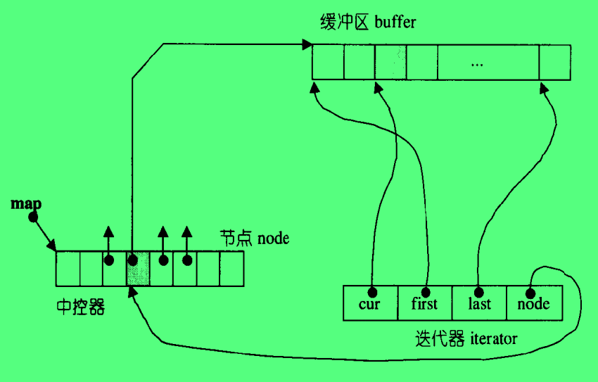
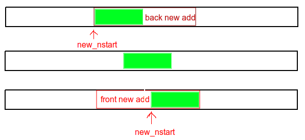

# 序列式容器

## vector

头文件 `#include<vector>`

vector 是一个"数组"，与 c++ 内建的数组类型 array 都是管理一片连续的地址空间，他们的区别在于 vector 是动态变化的，会自动扩展大小；而 array 是静态大小，需要在声明时指定数组大小，并且后续如果需要扩展，是需要程序员来实现 "新分配内存-拷贝数据-归还旧内存" 整个完整过程。

### vector 的数据结构：

```c++
template<typename T>
class vector{
    ...
    protected:
        iterator start;             // 当前有效数据域起始位置 
        iterator finish;            // 当前有效数据域终止位置（最后一个有效元素后面的位置，这是一个哨兵位） 
        iterator end_of_storage;    // 当前整个 vector 的总空间尾 
};
```

### vector 接口：

1. 构造函数
   1. **vector()** ：默认构造函数，新的容器空间大小为 0；
   2. **vector(size_type n,const T& value)** ：新的容器大小为 n ，每一个元素都初始化为 value；
   3. **explicit vector(size_type n)** ：新的容器大小为 n，每一个元素都调用其所属类型的默认构造函数；
2. 迭代器接口
    1. iterator **begin()**：返回 start，当前有效数据域起始地址；
    2. iterator **end()**：返回 finish，当前有效数据域终止位置（最后一个有效元素后面的位置，这是一个哨兵位）；
3. 容器状态接口（成员函数）
    1. size_type **size()** ：返回的是 `size_type(end()-begin())`，即当前容器中有效数据个数；
    2. size_type **capacity()** ：返回的是 `size_type(end_of_storage-begin())`，即当前容器可以容纳的总元素个数；
    3. bool **empty()** ：若当前容器内没有有效数据，则返回 false，否则返回 true；
    4. reference **front()** ：返回的是第一个元素，`return *begin();`
    5. reference **back()** ：返回的是最后一个有效元素，`return *(end()-1);`，再次验证了之前的 end() 是哨兵位；
    6. void **resize**(size_type new_size,const T& value)：重新调整 vector 的大小，如果 new_size 大于 `size()`，则在末尾插入 new_size - size() 个元素，每个元素都初始化为 value；如果 new_size 小于 `size()` ，则将多余的元素都擦除。
    7. void **resize**(size_type new_size)：调用 `resize(new_size,T());`
4. 元素操作接口（成员函数）
    1. void **push_back**(const T& value)：如果还有剩余空间，直接调用全局的 construct(finish,value)，在原本的 finish 位置上构建新的元素，然后 ++finish；
    2. void **pop_back()** ：其内部实现为`--finish;destroy(finish);`直接丢弃，并没有返回最后一个元素，所以在调用 `pop_back()` 之前，要是想得到最后一个元素值，应该先调用 `back()`。
    3. iterator **erase**(iterator first, iterator last);：该接口清除 \[first,last\) 之间的数据，并调整 finish 的位置。最后返回的是 first 的值。**erase 也可以接收一个参数，只擦除指定位置的元素**。
    4. void **clear()** ：erase(start,finish)；清空容器中的所有元素。
    5. void **insert**(iterator position,size_type n, T& value) ：在 position 位置插入 n 个元素，每个元素都初始化为值 value。这期间可能会涉及到内存的扩展，见下一节。

### 动态内存管理：

一个容器，从无到有的整个过程中，可能使用到的接口以及**规则**如下：

1. 对于**新内存的请求**，都是调用空间配置器的内存配置接口 `allocate()`;
2. 对于**未初始化的，已请求的内存块**，调用的是 `uninitialized_XXX` 簇函数。其中，将现有数据拷贝到未初始化内存，使用的是 `uninitialized_copy(first,last,result)`；给一个未初始化内存区间填充相同的元素，调用接口 `uninitialized_fill(first,last,value)`，或者是给一个起始位置，只填充 n 个元素，则调用 `uninitialized_fill_n(first,n,value)`。
3. 对于 **已初始化的内存块**，调用 STL 上层的算法，使用 `copy(first,last,result)` 拷贝数据；使用 `fill(first,last,value)` 填充数据。
4. 对于**单个元素**，使用全局的 `construct(position,value)` 来初始化内存。

现假设需要插入 n 个元素（push_back() or insert()），n > 0，**有关内存分配的过程**如下：

1. 判断当前的剩余空间(`(capacity()-size()) ? n`)是否足够容纳，如果是则直接插入即可。（插入过程根据上面的四点规则选择调用接口）；如果不足以容纳，转到第二步。
2. 剩余空间不够，则需要申请新的更大的内存空间，如果是 push_back(),则新的大小是原大小的两倍，`old_size = size();new_size = old_size==0 ? 1:2*old_size; ` ，如果是 insert()，则新的大小为 `new_size = old_size==0 ? 1:old_size + max(old_size,n);`。分配好内存之后就开始拷贝数据，由于新的内存是没有被初始化的，所以可以调用 `uninitialized_copy(start,finish,new_start)`；最后将原空间归还给系统，`destroy(begin(),end());deallocate()`。

## list

### list节点数据结构

```c++
template<typename T>
struct __list_node{
    typedef void* void_pointer;
    void_pointer prev;
    void_pointer next;
    T data;
}
```

从节点结构看，这是一个双向链表。**list 和 vector 都是数据结构，其实我们实际做运算的还是保存在里面的数据，所以当我们从 list 中取一个节点出来的时候，得到的应该是他的 data ，记住这一点很重要！** 后面在涉及到关于迭代器的时候，这个概念就会帮助理解设计原理。

### list迭代器

首先有一点，一个迭代器实例指代的一定是容器的某一个元素，所以在 list 中，一个迭代器一定包含一个 __list_node 节点，或者是有一个指向 __list_node 的指针成员。考虑到迭代器在遍历的过程中能够轻便的制定另一个容器元素，所以使用指向 __list_node 的指针成员来指定当前迭代器所代表的容器元素。

与 vector 不同， list 并非是一片连续内存，所以常规指针并无法满足迭代器的要求（vector 的迭代器是常规指针 void*），所以需要设计一个 __list_iterator 类来实现迭代器的常规操作。

```c++
template<typename T, typename Ref, typename Ptr>
struct __list_iterator{
    using iterator = __list_iterator<T,T&,T*>;
    using self     = __list_iterator<T,Ref,Ptr>;

    using iterator_category = bidirectional_iterator_tag;
    ...     //(nested type def)
    using link_type = __list_node<T> *;

    link_type node;

    //构造函数
    __list_iterator(link_type x):node(x){};
    __list_iterator(){};
    __list_iterator(const iterator& x):node(x.node){};

    //运算符重载
    bool operator==(const self& x) const {return node == x.node;}
    bool operator!=(const self& x) const {return node != x.node;}
    //递增递减
    self& operator++(){
        node = (link_type)((*node).next);
        return *this;
    }
    self operator++(int){
        self temp(*this);
        ++(*this);
        return temp;
    }
    self& operator--(){
        node = (link_type)((*node).prev);
        return *this;
    }
    self operator--(int){
        self temp(*this);
        --(*this);
        return temp;
    }
    //解引用
    reference operator*() const {return (*node).data;}
    pointer operator->() const {return &(operator*());}
}
```

说明：

1. `operator++()` 定义了前置自加运算符，所以在后置自加运算符(`operator++(int)`)的定义中使用的是重载了的 `operator++()` 运算符。自减运算符同理。
2. 关于自加和自减运算符的返回值类型，前置运算返回值类型为引用，是因为自加之后使用的就是返回的结果；后置运算返回值类型是按值传递的，再结合拷贝构造函数，是浅复制，所以返回了一个指向前一个容器元素的迭代器，也正是因为是浅复制，所以其实可以看做就是前一个迭代器本身。
3. 有关于解引用部分，回想之前说的，**当我们从 list 中取一个节点出来的时候，得到的应该是他的 data ，记住这一点很重要！** 对一个迭代器解引用，得到的应该是它所指代的容器元素的数据，所以相当于 `data_type * iterator;` 迭代器类型是一个数据的指针类型，那么 `iterator->` 相当于 `(&data)->` ，所以 `operator*()` 解引用运算符返回的结果是 `(*node).data;` 返回的是 data 本身，而 `operator->()` 返回的是 `&(operator*())` ，相当于返回的是 `&data` 。这里的 `operator*()` 就是已经被重载的解引用运算符。

### list 结构

list 不仅是一个双向链表，还是一个环形链表，所以仅使用一个节点指针就可以表示整个 list 了（下面 list 结构代码中的 node），为了适配 STL 的左闭右开区间规则，把这个起始节点置为空节点，而他的 next 才是整个 list 的 begin();

```c++
template<typename T,class Alloc=alloc>
class list{
    protected:
        typedef __list_node<T> list_node;
    public:
        typedef list_node* link_type;
    protected:
        link_type node;
};
```

### list 接口介绍

1. 构造函数
   1. **list()** ：`{empty_initilize();}` 产生一个空节点，也就是一个 list 对象的 node 成员；
2. 迭代器接口
    1. iterator **begin()**：`return link_type((*node).next)`；
    2. iterator **end()**：`return node`；
3. 容器状态接口（成员函数）
    1. size_type **size()** ：`distance(begin(),end(),result)`；
    2. bool **empty()** ：`return node == node->next`；
    3. reference **front()** ：`return *begin()`；
    4. reference **back()** ：`return *(--end())`；
4. 元素操作接口（成员函数）
    1. void **push_back**(const T& value)：`insert(end(),value)`；在链表尾插入一个新节点。
    2. void **push_front**(const T& value) `insert(begin(),value)`；在链表头插入一个阶段作为新的头节点。
    3. iterator **insert**(iterator position, const T& value)：在指定位置后面插入一个新的节点。首先会分配内存，然后使用全局的构造工具 construct 来初始化一个节点，接着调整相关的四个指针值。
    4. iterator **erase**(iterator position)： 擦除指定位置的节点，返回原被擦除节点的下一个节点。
    5. void **pop_back()** ：`{erase(--end())}`。
    6. void **pop_front()** `{erase(begin())};`
    7. void **clear()** ：清空容器中的所有元素，最后头节点恢复成 empty_initilize 执行之后的模样，`node->next = node;node->prev = node;`。
    8. void **remove**(const T& value) ：将值为 value 的所有元素都擦除掉。
    9. void **unique()** ：移除数值相同且连续的元素，最后只剩下一个。但是如果数值相同但是不连续是不会被移除的。
    10. void **splice**(iterator position, list& x) ：将链表 x 接合与 position 指定位置之前；由于是将整条链表都接合，所以 x 不能等于 *this。
    11. void **splice** (iterator position, iterator first, iterator last)：将 \[first,last\) 指向区间的元素插入到 position 之前， position 可以和 last，first 同一个链表，但是 position 不能在 \[first,last\) 中。
    12. void **merge** (list& x)：在使用 merge 之前，两个链表都必须是递增排序之后的，最后合并成一条递增链表。
    13. void **reverse()** ：将 *this 的内容逆向重置。
    14. void **sort()** ：list 不能使用 STL 算法中的 sort，因为 STL 的 sort 规定迭代器类型应该是 RandomAccessIterator，所以这里定义了 list 自己的 sort 函数，将 list 增序排序。

## deque

deque 是双端队列，既可以从队列头插入元素也可以从队列尾插入元素，当然并不仅限于头尾，也可以在中间插入。相较于 vector，他们的区别是，vector 只能向后扩展，但是 deque 可以向前扩展。deque 的每一个缓冲区都是一块连续线性空间。

deque **在逻辑上是连续的，但是实际上是由一段一段定长的连续空间组合成的逻辑连续空间。**

### deque定义

```c++
template<typename T,typename Alloc=alloc, size_t BufSiz = 0>
class deque{
    public:
        typedef T value_type;
        typedef value_type* pointer;
    protected:
        typedef pointer* map_pointer;
        map_pointer map;
        size_type map_size;
    ...
};
```

在 deque 定义中的 map 就是来实现逻辑上的线性连续的。由定义可知，map 是一个 T** 类型的变量，保存的是指向指针的指针，可以将 map 看成一个二维数组，第一维的数组成员是保存实际 T 类型数据的第二维缓冲区地址，第二维缓冲区是定长数组，数组长度为 BufSiz。每个缓冲区都是线性连续的地址空间，而通过 map 来实现不同缓冲区间的"线性"特性，当越过每个缓冲区边界的时候，跳转到下一个缓冲区取数据。

### deque迭代器

整体连续的假象，是由迭代器来完成的。主要是落在了 operator-- 和 operator++ 运算子身上。因为双端队列是通过中控器(deque类中的 map)和缓冲区块来实现的，其中一个双端队列对象就应该有一个中控器，这个是由 deque 对象来维护的，并且即使是跨缓冲区的遍历操作都是通过迭代器来实现，所以剩下的缓冲区就应该由迭代器来维护。

```c++
template<typename T,typename Ref, typename Ptr,size_t BufSiz>
struct __deque_iterator{
    ...
    static size_t buffer_size() {return __deque_buf_size(BufSiz,sizeof(T));}

    T* cur;
    T* first;
    T* last;
    map_pointer node;
    ...
}

inline size_t __deque_buf_size(size_t bufsiz,size_t item_size)
{
    return bufsiz != 0 ? bufsiz:(item_size < 512 ? size_t(512/item_size) : size_t(1));
}
```

可见，一个迭代器维护着一块缓冲区，即结构体当中的 node ，但是对迭代器解引用应该得到的保存在该容器中的值，所以还需要 cur,first,last 这三个变量来对缓冲区更细粒度的管理，对一个迭代器解引用的时候，实际返回的是当前迭代器所在缓冲区中的 cur 所指向的元素值。



上图就是 deque 中 map、迭代器中的 node、保存数据的缓冲区三者之间的关系图。

由函数 __deque_buf_size 的定义可知，迭代器的 buffer_size() 函数返回的是一个缓冲区当中可以存放的元素个数。

### deque 结构

list 不仅是一个双向链表，还是一个环形链表，所以仅使用一个节点指针就可以表示整个 list 了（下面 list 结构代码中的 node），为了适配 STL 的左闭右开区间规则，把这个起始节点置为空节点，而他的 next 才是整个 list 的 begin();

```c++
template<typename T,typename Alloc=alloc, size_t BufSiz = 0>
class deque{
    public:
        typedef T value_type;
        typedef value_type* pointer;
        typedef __deque_iterator<T,T&,T*,BufSiz> iterator;
    protected:
        typedef pointer* map_pointer;
        map_pointer map;

        iterator start;
        iterator finish;

        size_type map_size;
    ...
};
```

迭代器 start 表示的是整个 deque 有效数据区域的第一个缓冲区，finish 表示最后一个。

### deque 接口介绍

1. 构造函数
   1. **deque**(int n,const value_type& value) ：将要创建的 deque 初始化元素个数是指定的 n，且之前提到过的 buffer_size()函数返回的是一个缓冲区当中可以存放的元素个数，所以 n/buffer_size()+1 为需要的缓冲区（也就是节点）个数（，如果刚好整除，会多分配一个）。然后为所需的缓冲区分配空间，至少会分配 8 个缓冲区，分配完之后将有效数据区域放置于整个 map 的中间部分，为之后前后扩展预留节点。由于 deque 的第一个有效数据的节点就是 start，所以只要限制 start 和 finish 的值就可以限定有效数据在整个 map 中的位置。数据的区间确定之后，为每个元素都赋值为 value；
2. 迭代器接口
    1. iterator **begin()**：`return start`；
    2. iterator **end()**：`return finish`；
3. 容器状态接口（成员函数）
    1. size_type **size()** ：`return finish-start;`；
    2. bool **empty()** ：`return finish == start;`；
    3. reference **front()** ：`return *start`；
    4. reference **back()** ：`iterator temp=finish; --temp;return *temp;`；
4. 元素操作接口（成员函数）
    1. void **push_back**(const T& value)：在双端队列尾插入一个新节点。如果当前节点（缓冲区）尾有空余元素位置，则直接放到空闲元素位置即可。如果已经到达缓冲区边界，则需要扩展缓冲区，扩展过程见 [deque的扩展](#deque的扩展过程)。
    2. void **push_front**(const T& value) ：在双端队列头插入一个新节点。如果当前节点（缓冲区）前面有空余元素位置，则直接放到空闲元素位置即可。如果已经到达缓冲区边界，则需要扩展缓冲区，扩展过程见 [deque的扩展](#deque的扩展过程)。。
    3. iterator **insert**(iterator position, const T& value)：在指定位置后面插入一个新的元素。
    4. iterator **erase**(iterator position)： 擦除指定位置的节点，因为清理之后需要移动别的元素，在 vector 中只能将后面的数据前移，如果在 vector 的前面 erase 一个元素的话，需要移动的数据就会很多。但是 deque 是判断当前擦除节点的前面元素多还是后面元素多，他会选择移动较少数据的移动方向。返回的就是指向原被移除元素下一个元素的迭代器。**iterator erase(iterator first,iterator last)会移除\[first,last\)区间的元素。**
    5. void **pop_back()** ：需要考虑边界情况。
    6. void **pop_front()** ：需要考虑边界情况。
    7. void **clear()** ：清空 deque 中的所有元素，让 deque 恢复到最初的初始状态。 deque 的初始状态没有任何元素，但是还是保留有一个缓冲区。

### deque的扩展过程

该过程适用于 push_back 以及 push_front。

```c++
void reserve_map_at_front(size_type nodes_to_add = 1){
    if(nodes_to_add > start.node - map)
        reallocate_map(nodes_to_add,true);
}

void reserve_map_at_back(size_type nodes_to_add = 1){
    if(nodes_to_add + 1 > map_size - (finish.node - map))
        reallocate_map(nodes_to_add,false);
}

template<typename T,typename Alloc,size_t BufSiz>
void deque<T,Alloc,BufSiz>::reallocate_map(size_type nodes_to_add,bool add_at_front){
    size_type old_num_nodes = finish.node-start.node;
    size_type new_num_nodes = old_num_nodes + nodes_to_add;

    map_pointer new_nstart;
    if(map_size > 2 * new_num_nodes){
        /* 不额外分配空间，在当前的map中修正有效数据的位置到正中间 */
        new_nstart = map + (map_size - new_num_nodes)/2 +(add_at_front ? nodes_to_add : 0);
        /*
            copy data;
        */
    }
    else{
        /* 额外分配空间，即扩展 map 的大小 */
        size_type new_map_size = map_size + max(map_size,nodes_to_add) + 2;
        map_pointer new_map = map_allocator::allocate(new_map_size);
        new_nstart = new_map + (new_map_size - new_num_nodes) / 2 + (add_at_front ? nodes_to_add : 0);
        /*
            copy data;
        */
       map = new_map;
       map_size = new_map_size;
    }
    start.set_node(new_nstart);
    finish.set_node(new_nstart + old_num_nodes - 1);
}
```

从上述的代码可以得知，扩展过程如下：

1. 在扩展的时候首先会判断当前 map 中的剩余缓冲区是否足够执行扩展，如果足够，就不做任何事情直接返回。
2. 如果当前 map 某一方向的剩余缓冲区不足够扩展，就会重新调整 map 相关数据：
   1. 如果总的数据大小仍然小于 map 总大小的一半（这种情况就是一直都是在一个方向添加数据导致的该方向剩余缓冲区不够，但是另一个方向的缓冲区个数一直是最初的一半大小），那么就调整 start 和 finish 的位置，也就是重新将有效数据区域调整到 map 的正中间，然后返回。
   2. 如果总的数据大小已经超过 map 总大小的一半了，这时候就需要重新来分配一个更大的 map 来管理这个新的更大的逻辑线性连续空间。扩展的大小为 `new_map_size = map_size + max(map_size,nodes_to_add) + 2`，然后调整有效数据区域到新的 map 的正中间。
3. 扩展程序返回之后 map 大小以及有效数据位置已经被调整，这个时候直接在 map 中需要被新建的 node 位置填入数据即可。

**注意：** ：扩展程序中的 new_nstart 位置确定时候，末尾有一个修正数据 `(add_at_front ? nodes_to_add : 0)`，这是因为直到第三步的时候才会将数据填进去，所以这里的 start 仍然是旧数据的起始位置，并且根据 `new_map + (new_map_size - new_num_nodes) / 2` 以及 `finish.set_node(new_nstart + old_num_nodes - 1)` 可知，居中的时候是按新的总大小来居中的，并且最后只拷贝了原始数据，所以这里的修正是为了第三步做准备。



## stack

stack 是一种 FILO 的数据结构。底层使用 deque 来实现，封闭了其中一边的开口，并且不提供迭代器，因为不允许遍历 stack 中的元素，只能从 top 端读写。

### stack 接口

1. bool **empty()** const : 当前栈是否为空，是返回 true，否则 false；
2. size_type **size()** const : 返回当前栈中的元素个数；
3. reference **top()** ：返回当前栈顶的元素值，但是该元素不出栈，仅仅是查看。
4. const_reference **top()** const ：返回 const 限定的栈顶元素。
5. void **push** (const value_type& value) ：压栈；
6. void **pop()** ：直接出栈，返回值为空。

stack 底层也可以使用 list 来实现。

## queue

queue 是一种 FIFO 的数据结构。底层使用 deque 来实现，只从一端读，只从一端取，并且不提供迭代器，因为不允许遍历 queue 中的元素，只能从读端读，从写端写。

### queue 接口

1. bool **empty()** const : 当前队列是否为空，是返回 true，否则 false；
2. size_type **size()** const : 返回当前栈中的元素个数；
3. reference **front()** ：返回当前队列头的元素值，但是该元素不出队，仅仅是查看。
4. const_reference **front()** const ：返回 const 限定的队列头元素。
5. reference **back()** ：返回当前队列尾元素；
6. const_reference **back()** const ：返回 const 限定的队尾元素值。
7. void **push** (const value_type& value) ：入队；
8. void **pop()** ：直接出队，返回值为空。

queue 底层也可以使用 list 来实现。

## heap（大根小根堆）

根据《算法导论》中对于大根堆和小根堆，这里提供了四个接口（算法）来调整一个可以随机访问的容器成为一个大根堆。

1. void **make_heap** (RandomAccessIterator first,RandomAccessIterator last) : 将\[first,last\)区间的元素调整成符合大根堆的元素序列。
2. inline void **push_heap** (RandomAccessIterator first,RandomAccessIterator last) : 在调用这个接口之前，应该先将要加入到堆里面的元素手动添加到容器末尾。
   ```c++
   my_vector.push_back(new_value);
   push_heap(my_vector.begin(),my_vector.end());
   //after invoke push_heap, the new_value will be put into the right position.
   ```
3. inline void **pop_heap** (RandomAccessIterator first, RandomAccessIterator last) : 该接口的功能是将大根堆的最大元素（容器最前面的元素）放置到最末尾，并且调整除末尾外的元素位置，使其符合大根堆特性。如果还需要继续从容器前端提取最大元素，那么应该是 cur_last = prev_last - 1。一旦调用了 pop_heap() 之后，my_vector.back() 就是容器中的最大元素。
4. sort_heap 实际就是采用了上述的做法来对容器升序排序。
   ```c++
   template<typename RandomAccessIterator>
   void sort_heap(RandAccessIterator first, RandomAccessIterator last){
       while(last - first > 1)
        pop_heap(first,last--);
   }
   ```

## priority_queue

优先级队列，底层使用默认使用 vector 加上 heap 算法来实现，每一次对容器元素修改都是调用 heap 接口来实现，所以每一次修改之后容器中的元素都是维持了大根堆特性的。

### priority 完整定义

```c++
template<typename T, typename Sequence = vector<T>,typename Compara = less<typename Sequence::value_type> >
class priority_queue{
    public:
        typedef typename Sequence::value_type value_type; 
        typedef typename Sequence::size_type size_type; 
        typedef typename Sequence::reference reference; 
        typedef typename Sequence::const_reference const_reference; 
    protected:
        Sequence c; //底层容器
        Compara comp;
    public:
        priority_queue():c(){}
        explicit priority_queue(const Compara& x):c(),comp(x){}
        template<typename InputIterator>
        priority_queue(InputIterator first,InputIterator last,const Compara& x):c(first,last),comp(x){make_heap(c.begin(),c.end(),comp);}
        template<typename InputIterator>
        priority_queue(InputIterator first,InputIterator last):c(first,last){make_heap(c.begin(),c.end(),comp);}

        bool empty() const {return c.empty();}
        size_type size() const {return c.size();}
        const_reference top() const {return c.front();}
        
        void push(const value_type& value){
            __STL_TRY{
                c.push_back(value);
                push_heap(c.begin(),c.end(),comp);
            }
            __STL_UNWIND(c.clear());
        }

        void pop(){
            __STL_TRY{
                pop_heap(c.begin(),c.end(),comp);
                c.pop_back();
            }
            __STL_UNWIND(c.clear());
        }
};
```

## slist(single linked list)

list 是双向链表，而 slist 是单向链表。

因为 slist 是单向链表，即使在插入和擦除的时候指定了位置，但是仍然需要被插入位置和被擦除位置的前一个节点信息，故而对于单向链表，执行需要得知前一个节点信息的操作的时候，如果没有在链表的开始，效率是很低的。所以 slist 提供的接口相较于 list 添加了 insert_after() 和 erase_after(),并且不提供 push_back() 接口，而只有 push_front()。并且由于是单向的，其迭代器类型也不是 list 的 bidirectional_iterator ,而是 forward_iterator，所以并没有实现 -- 的前置与后置操作，仅实现了 ++ 的前置与后置。

### slist 接口：

1. 构造函数
   1. **slist()** ：初始为一个空链表，head 指向一个 nullptr；
2. 迭代器接口
    1. iterator **begin()**：`return iterator((list_node*)(head.next));`；
    2. iterator **end()**：`return iterator(0);`；
3. 容器状态接口（成员函数）
    1. size_type **size()** ：返回当前链表中有效节点个数，head 不算；
    2. bool **empty()** ：若当前容器内没有有效数据，则返回 false，否则返回 true；
    3. reference **front()** ：返回的是第一个元素，`return ((list_node*)head.next)->data;`
4. 元素操作接口（成员函数）
    1. void **push_front**(const T& value)：。
    2. void **pop_front()** ：。
    3. void **swap(slist& L)** :将两个单向链表进行交换很简单，只需要交换 head 的值就可以了。

[返回主目录](../../README.md)